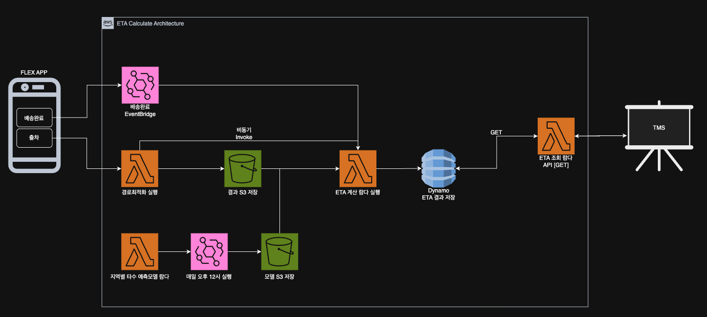
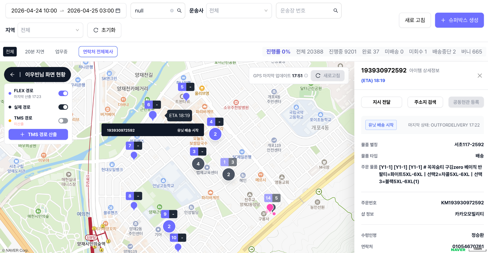
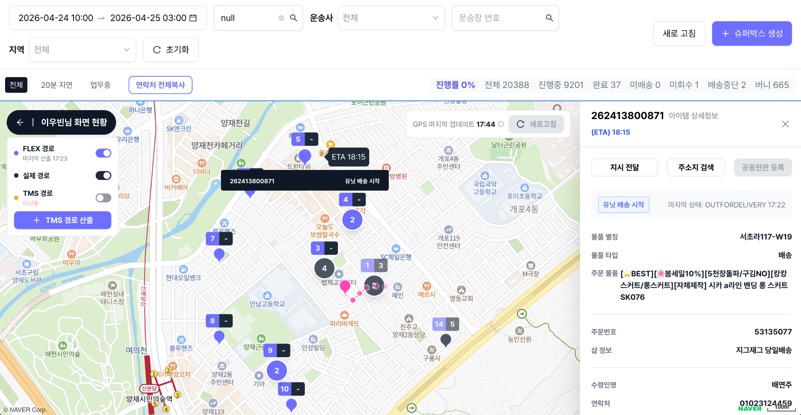

# 🚚 Delivery ETA Prediction Lambda

배송 경로최적화 결과와 이동시간(OSRM), 지역별 작업시간 예측 모델을 결합하여 배송 도착 예정 시간(ETA)을 계산하고 TMS에서 조회할 수 있도록 저장하는 Serverless MLOps 프로젝트입니다.

> 본 저장소는 포트폴리오 공개용으로 정리한 버전입니다. 실제 운영 계정, S3 Bucket, Function URL, DB 테이블명, 고객사 정보, 송장번호 등 민감 정보는 샘플 값으로 치환했습니다.

---

## 📌 프로젝트 개요

배송 기사가 출차하거나 배송을 완료하면, ETA 계산 Lambda가 현재 배송 순서와 남은 배송지를 기준으로 ETA를 다시 계산합니다. 계산 결과는 DynamoDB에 저장되고, TMS는 GET API를 통해 최신 ETA를 조회합니다.

### 핵심 기능

- 경로최적화 결과 기반 배송 순서 추출
- OSRM 이동시간 기반 stop 간 이동시간 계산
- 지역/요일/시간대 기반 작업시간 예측 모델 적용
- 배송완료 EventBridge 이벤트 수신 후 ETA 재계산
- DynamoDB 기반 최신 ETA 조회 API 제공
- 동일 주소/동일 수령지 중복 ETA 계산 방지

---

## 🏗 Architecture



### 전체 흐름

1. Flex App에서 출차 또는 배송완료 이벤트 발생
2. 경로최적화 Lambda가 방문 순서를 계산하고 S3에 결과 저장
3. ETA Calculate Lambda가 경로 결과, OSRM 이동시간, 작업시간 예측값을 조합하여 ETA 계산
4. 계산 결과를 DynamoDB에 저장
5. TMS가 ETA Query Lambda GET API를 호출하여 최신 ETA 조회

---

## 📸 TMS 적용 화면

TMS 지도 화면에서 각 배송지 marker에 ETA가 표시됩니다.





---

## 🧠 ETA 계산 로직

ETA는 출차 시각 또는 현재 시각을 기준으로 누적 계산합니다.

```text
ETA(1) = base_time + travel_time(unit → stop_1) + service_time(stop_1)
ETA(n) = ETA(n-1) + travel_time(stop_n-1 → stop_n) + service_time(stop_n)
```

### 주요 처리 기준

- 최초 계산: 출차 시각 기준으로 전체 ETA 생성
- 배송완료 후 재계산: Lambda 실행 시점 기준으로 남은 배송지 ETA 재산출
- 동일 `address_id`를 가진 복수 송장은 하나의 배송지로 간주하여 중복 ETA 방지
- 모델에 없는 sector/area는 default 작업시간으로 fallback

---

## ⚙️ Tech Stack

| 구분 | 기술 |
|---|---|
| Compute | AWS Lambda, AWS SAM, Container Image |
| Event | Amazon EventBridge |
| Storage | Amazon S3, Amazon DynamoDB |
| Routing | OSRM |
| ML/Data | Python, Pandas, scikit-learn/joblib |
| API | Lambda Function URL |

---

## 📂 Repository Structure

```text
.
├── app.py                         # ETA 계산 Lambda handler
├── query_eta_app.py               # ETA 조회 GET API Lambda handler
├── model_loader.py                # S3 모델 artifact 로더
├── predict.py                     # 작업시간 예측 로직
├── clients/
│   ├── osrm_client.py             # OSRM route API client
│   └── route_result_client.py     # 경로최적화 결과 조회 client
├── queries/
│   ├── itemdata.py                # 배송 아이템 조회 샘플 쿼리
│   └── apartment_flag.py          # 주소/건물 속성 조회 샘플 쿼리
├── utils/
│   ├── db_handler.py              # MySQL 연결 유틸
│   ├── db_handler_pg.py           # PostgreSQL 연결 유틸
│   ├── event_parser.py            # EventBridge/API payload parser
│   └── sector_utils.py            # sector/area 정규화
├── events/
│   ├── event.json                 # 로컬 테스트용 payload
│   └── shipping_complete_event.json
├── docs/images/
│   ├── architecture.png
│   ├── tms_eta_1.png
│   └── tms_eta_2.png
├── template.yaml                  # AWS SAM template
├── samconfig.example.toml         # 배포 설정 예시
├── Dockerfile
└── requirements.txt
```

---

## 🔁 Event Trigger

### 1. 경로최적화 완료 후 ETA 생성

```json
{
  "user_id": 1234,
  "route_s3": {
    "bucket": "sample-route-result-bucket",
    "key": "route-optimization/dt=2026-04-24/user_id=1234/request_id=sample.json"
  }
}
```

### 2. 배송완료 EventBridge 수신 후 ETA 재계산

```json
{
  "detail-type": "ShippingItemExternalNotification",
  "source": "sample.api",
  "detail": {
    "params": {
      "env": "dev",
      "tracking_number": "SAMPLE_TRACKING_NUMBER"
    }
  }
}
```

---

## 🗄 DynamoDB 저장 구조

| Key | 설명 |
|---|---|
| `user_id` | 배송 기사 또는 사용자 ID |
| `tracking_number` | 송장번호 또는 item 식별자 |
| `eta_kst` | KST 기준 ETA |
| `ordering` | 경로최적화 방문 순서 |
| `latest_calculated_at` | 마지막 계산 시각 |
| `route_s3` | 기준 경로최적화 결과 S3 위치 |

---

## 🚀 Local Test

```bash
sam build --no-cached
sam local invoke TasuEtaCalculateFunction -e events/event.json
```

조회 Lambda 테스트:

```bash
sam local invoke TasuEtaQueryFunction -e events/query_event.json
```

---

## 🚀 Deploy Example

실제 계정 정보는 `samconfig.toml`에 직접 커밋하지 않고, 아래 예시 파일을 복사해서 로컬에서만 사용합니다.

```bash
cp samconfig.example.toml samconfig.toml
sam build --no-cached --config-env dev
sam deploy --config-env dev
```

---

## 🔒 Public Repository Sanitizing

공개 저장소 업로드 전 다음 항목을 제거/치환했습니다.

- 실제 AWS 계정 ID
- 실제 S3 Bucket 이름
- 실제 Lambda Function URL
- 실제 EventBus 이름
- 실제 DB 테이블명 및 고객사명
- 실제 송장번호, 연락처, 사용자 ID
- `.git`, `__pycache__`, `.DS_Store`, `samconfig.toml`

---

## 💡 Portfolio Highlights

- 실서비스 TMS 화면에 ETA 결과를 제공한 Lambda 기반 시스템
- 경로최적화 결과와 ML 예측 모델을 연결한 MLOps 구조
- EventBridge 기반 ETA 자동 갱신 구조 설계
- DynamoDB를 활용한 빠른 최신 ETA 조회 API 구현
- 운영 데이터 품질 이슈를 고려한 fallback 및 중복 배송지 처리 로직 반영
